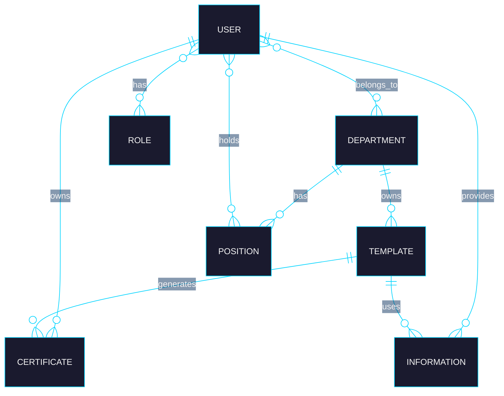

<h1 align="center">Certificadazo</h1>

  

<i>An AI-assisted platform to create, manage, and validate certificates, without the headache.</i>

  

  &nbsp;
  &nbsp;
  &nbsp;
  &nbsp;
  &nbsp;
  &nbsp;
  

 

## 🤔 What's this all about?

Ever had to make a certificate by hand, then chase people down to send it, then have no real way to prove it's legit? That's the exact headache **Certificadazo** is here to solve.

It's a platform where a department can design a certificate template once, plug in the data, and generate polished, official-looking certificates in bulk, then let anyone check if a certificate is real with a simple public validation link. No more *"is this PDF actually official?"* moments.

 

## 👥 Who's it for?

The platform is built around four kinds of people:

| Who | What they can do |
|---|---|
| 🛠️ **Admin** | Manages users, manages departments, configures API keys |
| 🏢 **Department Manager** | Manages their department, manages their users, creates certificate templates |
| 🙋 **User** | Manages their own profile, downloads their certificates |
| 🔎 **Guest** | Validates a certificate (no account needed) |

 

## 🎯 The main goal

Create certificates, send them out, and let anyone validate them publicly. That's the heart of it.

 

## ✅ What's in scope

- [x] Create users
- [x] Create departments
- [x] Create certificate templates
- [x] Generate certificates as PDF
- [ ] Public certificate validation

 

## 🧩 How the data fits together

Here's the general idea of how everything connects behind the scenes:

In plain terms:
- A **User** can belong to one or more **Departments**, hold different **Positions**, and have different **Roles**.
- A **Department** owns its own **Templates** and **Positions**.
- A **Template** is the "blueprint" used to generate **Certificates**, and can also hold extra **Information** tied to a specific user.
- A **Certificate** always points back to the user it belongs to and the template it was generated from.

 

## 🗂️ Data model in detail

A closer look at each entity and the fields it holds. Click any card to expand it.

👤&nbsp;&nbsp;<b>User</b>

 

| Field | Type | Notes |
|---|---|---|
| `id` | `binary(16)` | 🔑 Primary Key |
| `name` | `varchar(255)` | |
| `document` | `varchar(25)` | 🔒 Unique |
| `password` | `varchar(255)` | |

🎭&nbsp;&nbsp;<b>Role</b>

 

| Field | Type | Notes |
|---|---|---|
| `id` | `binary(16)` | 🔑 Primary Key |
| `name` | `varchar(25)` | |

🏢&nbsp;&nbsp;<b>Department</b>

 

| Field | Type | Notes |
|---|---|---|
| `id` | `binary(16)` | 🔑 Primary Key |
| `name` | `varchar(255)` | |

💼&nbsp;&nbsp;<b>Position</b>

 

| Field | Type | Notes |
|---|---|---|
| `id` | `binary(16)` | 🔑 Primary Key |
| `name` | `varchar(255)` | |
| `department_id` | `binary(16)` | 🔗 Foreign Key → Department |

📄&nbsp;&nbsp;<b>Template</b>

 

| Field | Type | Notes |
|---|---|---|
| `id` | `binary(16)` | 🔑 Primary Key |
| `name` | `varchar(255)` | 🔒 Unique |
| `design` | `varchar(255)` | |
| `department_id` | `binary(16)` | 🔗 Foreign Key → Department |
| `preview_src` | `varchar(255)` | 🔒 Unique |
| `fields` | `JSON` | |
| `images_src` | `JSON` | |

🧾&nbsp;&nbsp;<b>Information</b>

 

| Field | Type | Notes |
|---|---|---|
| `id` | `binary(16)` | 🔑 Primary Key |
| `data` | `JSON` | |
| `template_id` | `binary(16)` | 🔗 Foreign Key → Template |
| `user_id` | `binary(16)` | 🔗 Foreign Key → User |

🎓&nbsp;&nbsp;<b>Certificate</b>

 

| Field | Type | Notes |
|---|---|---|
| `id` | `binary(16)` | 🔑 Primary Key |
| `code` | `varchar(20)` | 🔒 Unique |
| `resource` | `varchar(255)` | 🔒 Unique |
| `issue_date` | `datetime` | |
| `expiration_date` | `datetime` | |
| `user_id` | `binary(16)` | 🔗 Foreign Key → User |
| `template_id` | `binary(16)` | 🔗 Foreign Key → Template |

🔗&nbsp;&nbsp;<b>Relationship tables</b>

 

**User ↔ Position**

| Field | Type | Notes |
|---|---|---|
| `user_id` | `binary(16)` | 🔑 Composite Primary Key |
| `position_id` | `binary(16)` | 🔑 Composite Primary Key |

**User ↔ Role**

| Field | Type | Notes |
|---|---|---|
| `user_id` | `binary(16)` | 🔑 Composite Primary Key |
| `role_id` | `binary(16)` | 🔑 Composite Primary Key |

**User ↔ Department**

| Field | Type | Notes |
|---|---|---|
| `user_id` | `binary(16)` | 🔑 Composite Primary Key |
| `department_id` | `binary(16)` | 🔑 Composite Primary Key |

 

## 🛠️ Built with

- **Java 25** + **Spring Boot 4.1.0** - the backbone of the backend
- **Spring AI 2.0.0** - helping automate and smooth out certificate generation
- **MySQL 9** - where all the data lives
- **Keycloak 25** - handling authentication and access control
- **Apache Kafka** - keeping things async and event-driven between services
- **Docker** - so it runs the same everywhere

 

## 🚧 Project status

Still cooking! This project is actively being built out: the core design, database structure, and user flows are already mapped out, and features are being added step by step. Screenshots and a proper walkthrough are coming soon once the UI takes shape.

 

## 👨‍💻 Contact / Author

**JuDa Dev** - Full Stack Developer  

  

> **Interested in collaborating or have questions?** Don't hesitate to contact me via email or LinkedIn.
